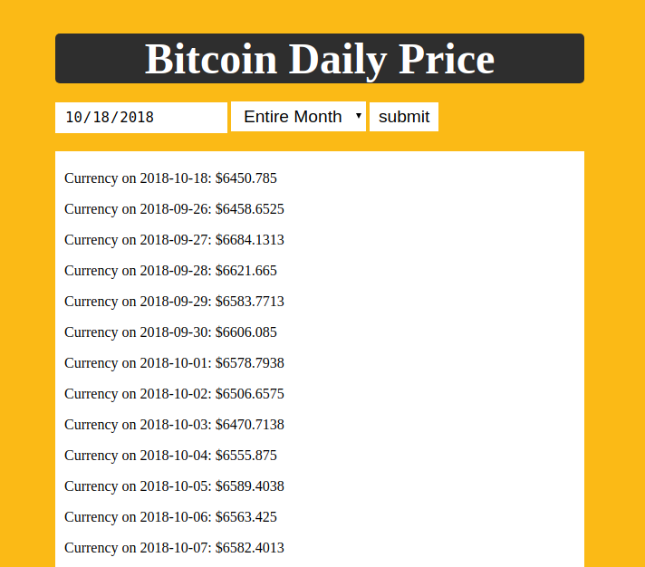

# Bitcoin Daily API
Used coindesk.com API to get bitcoin price for the date inouted by the user

## How It's Made:

**Tech used:** HTML5, CSS3, JavaScript, NASA's API & openweathermap's API.
Styling for this project was done using CSS Grid & Flexbox. Written in vanilla Javascript using the fetch method to access API.

## Examples:

**Weather API** https://github.com/ericamendez/weather-api-bootcamp2018c-week07

**Simple NASA API** https://github.com/ericamendez/simple-nasa-api-bootcamp2018c-week07

**Daily Code Challenges:** https://github.com/Eriquette/Daily-Code-Challenges
